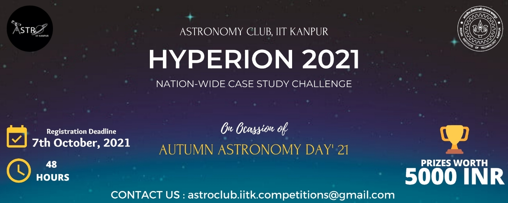

# Hyperion-2021

## Introduction

A  case study challenge conducted by Astronomy Club (<a href="https://github.com/astroclubiitk" target="_blank">@astroclubiitk</a>), IIT Kanpur conducted on 8th - 9th October 2021 to mark the Autumn World Astronomy Day, 2021. More than 1000 students participated from 26+ institutes nationwide, including 23 IITs.

The scientific paper on <a href="https://arxiv.org/abs/1812.07578" target="_blank">Probing Dark Matter Using Precision Measurements of Stellar Accelerations</a>, by <b>Aakash Ravi et al</b> was analysed to construct the case study problem and generate reasonably accurate artificial data to solve the problem.

## General Information
    -   The details of the challenge can be found in the Documents folder
    -   The data to be used for analysis can be found in the Data folder
    -   The codes used to generate the dataset and random experiments can be found in the Code folder
    -   The winning submissions can be found in the Results folder

## Team Members
### Coordinators
    -   Gurbaaz Singh Nandra
    -   Mohammad Saad
    -   Sunny Kumar Bhagat
    -   Varun Muralidharan
### Secretaries involved
    -   Adit Jain
    -   Shashank Sinha
    -   Vasu Paliwal

 

## COSMOS IS WITHIN US!